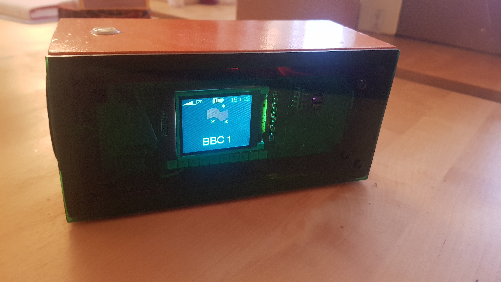

# OranjeRadio

web radio with VS1053 and gesture control using PAJ7620
 
<ul>
<li>
For the VS1053, this library is used :
https://github.com/baldram/ESP_VS1053_Library
</li>
<li>For the PAJ7620, this library is used:
https://github.com/Seeed-Studio/Gesture_PAJ7620 (also available via the Arduino library manager)
</li>
</ul>
For hardware used see:
<a href="https://oshwlab.com/peut/webradio">webradio</a>
